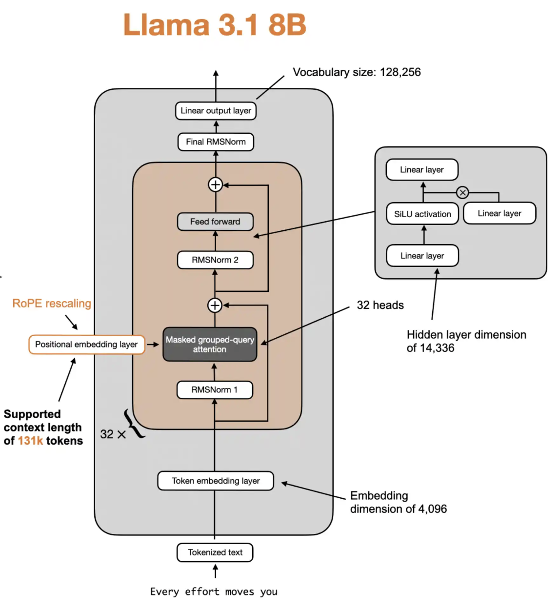

# Llama3 Architecture - Math

This article covers the math and matrix shapes of the Llama3 architecture. 

## High-level Llama3.1 architecture
Below is a diagram showing the Llama 3.1 8B architecture, which is a "dense" transformer.

## Matrix Dimensions

### Model Parameters (Weights)
| Variable | Description | Dimensions |
|----------|-------------|------------|
| $W_{\text{embeddings}}$ | Token embedding matrix | $(V, d)$ |
| $w_{a,\ell}, w_{b,\ell}$ | RMSNorm scale parameters (layer $\ell$) | $(d,)$ |
| $W_{q,\ell}, W_{k,\ell}, W_{v,\ell}$ | QKV projection weights (layer $\ell$) | $(d, d)$ |
| $W_{o,\ell}$ | Output projection weights (layer $\ell$) | $(d, d)$ |
| $W_{\text{gate},\ell}, W_{\text{up},\ell}$ | FFN gate/up weights (layer $\ell$) | $(d, 4d)$ |
| $W_{\text{down},\ell}$ | FFN down weights (layer $\ell$) | $(4d, d)$ |
| $W_{\text{lm}}$ | Language model head | $(d, V)$ |
| $w_{\text{final}}$ | Final RMSNorm scale parameters | $(d,)$ |

Where $\ell$ = layer index ($\ell = 1, 2, \ldots, L$)

### Input:
| Variable | Description | Dimensions |
|----------|-------------|------------|
| $S$ | Token sequence (input IDs) | $(s,)$ |

Where:
- $s$ = sequence length
- $d$ = model dimension (hidden size)
- $V$ = vocabulary size

## Math
**Inputs / Sampling**

Let tokens be $S: (s)$.  

$X = \mathrm{Embed}(S) = W_{\text{embeddings}}[S]$

(Equivalent to treating $S$ as one-hot and multiplying by $W_{\text{embeddings}}$ for exposition.)

$(s) \mapsto (s, d)$

**Repeat for layers $\ell = 1..L$:**

1. **Pre-RMSNorm (for Attention sublayer)**  
   
   Define $\mathrm{RMSNorm}(x; w) = \dfrac{x}{\sqrt{\mathrm{mean}(x^2) + \epsilon}} \odot w$.  

   $X_{\text{attn in}} = \mathrm{RMSNorm}(X; w_{a,\ell})$

   $(s, d) \odot (d) \to (s, d)$

2. **QKV projections**  

   $Q = X_{\text{attn in}}W_{q,\ell}$

   $K = X_{\text{attn in}}W_{k,\ell}$

   $V = X_{\text{attn in}}W_{v,\ell}$

   $(s, d) \times (d, d) \to (s, d)$

   Reshape Q,K,V for attention heads:

   $Q,K,V \;\mapsto\; (s, n_h, d_h),\quad d = n_h \cdot d_h$

   Where:
   - $n_h$ = number of attention heads
   - $d_h$ = attention head dimension 

3. **RoPE embeddings (per head)**  
   
   Apply RoPE along the last (head) dimension for each head:

   $Q_h = Q_h \odot \cos + \mathrm{rotate}(Q_h)\odot \sin$

   $K_h = K_h \odot \cos + \mathrm{rotate}(K_h)\odot \sin$

   $(s, d_h) \to (s, d_h)\ \text{per head}$

4. **Multi-Head Attention (per head $h$)**  
   
   Compute attention scores, weights, and context per head:

   $S_h = \frac{Q_h K_h^\top}{\sqrt{d_h}} + M \quad \text{(attention scores)}$

   $A_h = \mathrm{softmax}(S_h) \quad \text{(attention weights)}$

   $C_h = A_h V_h \quad \text{(attention context)}$

   Concatenate heads:  

   $C = \mathrm{concat}_h(C_h) \in \mathbb{R}^{s\times d}$

   *Mask definition:* $M_{ij}=0$ if $j\le i$, and $-\infty$ otherwise; broadcast across batch and heads.  
   *Softmax is implemented with max-subtraction for numerical stability.*

5. **Attention Output Projection**  

   $X_{\text{attn out}} = C\, W_{o,\ell}$

   $(s, d) \times (d, d) \to (s, d)$

6. **Residual**  

   $X_{\text{attn out res}} = X + X_{\text{attn out}}$

   $(s, d) + (s, d) \to (s, d)$

7. **Pre-RMSNorm (for SwiGLU FFN sublayer)**  

   $X_{\text{ffn in}} = \mathrm{RMSNorm}(X_{\text{attn out res}}; w_{b,\ell})$

   $(s, d) \odot (d) \to (s, d)$

8. **SwiGLU FFN**  

   $U = X_{\text{ffn in}} W_{\text{up},\ell}$

   $G = X_{\text{ffn in}} W_{\text{gate},\ell}$

   $X_{\text{ffn out}} = (\mathrm{SiLU}(G)\odot U)\, W_{\text{down},\ell}$

   $((s, 4d) \odot (s, 4d)) \times (4d, d) \to (s, d)$

   Where $\mathrm{SiLU}(x) = x \odot \sigma(x) = \dfrac{x}{1 + e^{-x}}$.

9. **Residual**  

   $X_{\text{ffn out res}} = X_{\text{attn out res}} + X_{\text{ffn out}}$

   $(s, d) + (s, d) \to (s, d)$

10. **Feed output of layer $\ell$ into input of next layer $\ell+1$**  

    $X = X_{\text{ffn out res}}$

**Final RMSNorm**  

$X_{\text{final}} = \mathrm{RMSNorm}(X; w_{\text{final}}) = \frac{X}{\sqrt{\mathrm{mean}(X^2) + \epsilon}} \odot w_{\text{final}}$

$(s, d) \odot (d) \to (s, d)$

**Logits**  

$\text{logits} = X_{\text{final}} W_{\text{lm}}$

$(s, d) \times (d, V) \to (s, V)$

*Some implementations tie $W_{\text{lm}} = W_{\text{embeddings}}^T$*

**Output token (choose one):**

1. **Greedy Decoding**

   $\text{next token} = \arg\max_i \text{logits}_i$

   $(s, V) \to (s,)$

2. **Sampling with Temperature**

   $p_i = \frac{\exp(\text{logits}_i / T)}{\sum_j \exp(\text{logits}_j / T)}$

   $(s, V) \to (s, V)$

   $\text{next token} \sim \text{Categorical}(p)$

   $(s, V) \to (s,)$

3. **Top-k Sampling**

   $\text{top-k logits} = \text{top}_k(\text{logits})$

   $(s, V) \to (s, k)$

   $p_i = \frac{\exp(\text{top-k logits}_i / T)}{\sum_j \exp(\text{top-k logits}_j / T)}$

   $(s, k) \to (s, k)$

   $\text{next token} \sim \text{Categorical}(p)$

   $(s, k) \to (s,)$

Where $T$ is temperature and $k$ is the number of top tokens to consider.

## Differences between the math above and a practical Llama3 implementation

1. **Batching**: Real code operates on batches (the **B** dimension), while the math above presents a single sequence with $X$ having shape $(s,d)$. In practice, $X$ would have shape $(B, s, d)$ and this extra leading dimension is broadcast throughout all operations.

2. **Multi-Head Attention**: The math presents $Q, K, V \in \mathbb{R}^{s \times d}$ but implementations reshape to heads, e.g. $(B, s, n_h, d_h)$, compute per-head attention, concatenate back to $(B, s, d)$, then apply $W_o$.

3. **KV Caching**: For autoregressive decoding, implementations keep running key/value caches across steps so each new token only attends to previously cached states. The math shows full-sequence recomputation and omits caching; in practice logits are often computed just for the last position, with shape $(B, 1, V)$.

4. **Grouped Query Attention (GQA)**: Implementations may use fewer $K/V$ heads than $Q$ heads and repeat or map $K/V$ across query-head groups. The math assumes the same number of heads for $Q, K, V$.

*Note:* Practical code implementation also includes details such as masking/padding mechanics, numerical-stability tricks (e.g., fused softmax with max-subtraction, epsilon clamps), device/dtype management, and kernel/layout choices for speed.
